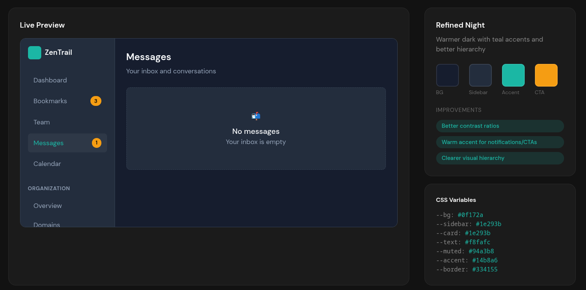

# Angular Project Guidelines

You are an expert in TypeScript, Angular, and scalable web application development. You write functional, maintainable, performant, and accessible code following Angular and TypeScript best practices.

## Project Architecture

### Technology Stack

- **Angular**: v21.0.0 (latest standalone architecture)
- **TypeScript**: v5.9.2 (strict mode enabled)
- **Node/npm**: npm@11.4.2
- **UI Framework**: PrimeNG v21.0.1 with custom Nora preset
- **Styling**: Tailwind CSS v4.1.17 with PrimeUI plugin
- **Icons**: Lucide Angular v0.561.0 & PrimeIcons v7.0.0
- **Testing**: Vitest v4.0.8
- **Build Tool**: Angular Build (esbuild-based)

### Project Structure

```
src/app/
├── core/                    # Core functionality
│   ├── guards/             # Route guards
│   ├── interceptors/       # HTTP interceptors (auth.interceptor)
│   ├── services/           # Singleton services (theme.service)
│   └── index.ts           # Public API exports
├── features/               # Feature modules (lazy-loaded)
│   ├── bookmarks/
│   ├── calendar/
│   ├── dashboard/
│   ├── domains/
│   ├── messages/
│   ├── overview/
│   ├── profile/
│   ├── reports/
│   ├── settings/
│   └── team/
├── layout/                 # Layout components
│   ├── header/
│   ├── main-layout/
│   ├── sidebar/
│   └── user-menu/
├── shared/                 # Shared resources
│   ├── components/         # Reusable components
│   ├── directives/         # Custom directives
│   ├── pipes/             # Custom pipes
│   └── index.ts           # Public API exports
├── app.config.ts          # Application configuration
├── app.routes.ts          # Route definitions
└── app.ts                 # Root component
```

### Key Architectural Patterns

1. **Feature-based organization**: Each feature is self-contained in its own directory
2. **Core module**: Singleton services and app-wide functionality
3. **Shared module**: Reusable components, directives, and pipes
4. **Barrel exports**: Use `index.ts` files for clean imports
5. **Lazy loading**: All feature routes are lazy-loaded for optimal performance

## TypeScript Configuration

### Strict Type Checking (Enabled)

- `strict: true`
- `noImplicitOverride: true`
- `noPropertyAccessFromIndexSignature: true`
- `noImplicitReturns: true`
- `noFallthroughCasesInSwitch: true`
- `strictInjectionParameters: true`
- `strictInputAccessModifiers: true`
- `strictTemplates: true`

### Best Practices

- Use strict type checking (already enabled)
- Prefer type inference when the type is obvious
- Avoid the `any` type; use `unknown` when type is uncertain
- Target: ES2022 with `module: "preserve"`
- Always use `experimentalDecorators: true` for Angular

## Angular Best Practices

### Components

- **Always use standalone components** (NgModules are deprecated)
- **MUST NOT set `standalone: true`** in decorators (it's the default in Angular v21+)
- Keep components small and focused on a single responsibility
- Use `input()` and `output()` functions instead of decorators
- Use `computed()` for derived state
- Set `changeDetection: ChangeDetectionStrategy.OnPush` in `@Component` decorator
- Prefer inline templates for small components
- When using external templates/styles, use paths relative to the component TS file
- Do NOT use `@HostBinding` and `@HostListener` decorators
  - Put host bindings inside the `host` object of the `@Component` or `@Directive` decorator instead

### Forms

- Prefer Reactive forms instead of Template-driven ones
- Use typed forms with strong type inference

### Templates

- Keep templates simple and avoid complex logic
- Use native control flow (`@if`, `@for`, `@switch`) instead of `*ngIf`, `*ngFor`, `*ngSwitch`
- Do NOT use `ngClass`, use `class` bindings instead
- Do NOT use `ngStyle`, use `style` bindings instead
- Use the async pipe to handle observables
- Do not assume globals like (`new Date()`) are available
- Do not write arrow functions in templates (they are not supported)

### State Management

- Use signals for local component state
- Use `computed()` for derived state
- Keep state transformations pure and predictable
- Do NOT use `mutate` on signals, use `update` or `set` instead
- Use `effect()` for side effects that depend on signal changes

### Services

- Design services around a single responsibility
- Use the `providedIn: 'root'` option for singleton services
- Use the `inject()` function instead of constructor injection
- Place services in `core/services/` for app-wide singletons
- Use `DestroyRef` for cleanup instead of `OnDestroy` lifecycle hook

### Routing

- Implement lazy loading for feature routes
- Use `withComponentInputBinding()` to bind route params to component inputs
- Place route guards in `core/guards/`

### HTTP

- Use `provideHttpClient()` with functional interceptors
- Place interceptors in `core/interceptors/`
- Use `withInterceptors([])` to register interceptors

### Images

- Use `NgOptimizedImage` for all static images
- Note: `NgOptimizedImage` does not work for inline base64 images

## Application Configuration

### Providers (app.config.ts)

```typescript
- provideBrowserGlobalErrorListeners()
- provideRouter(routes, withComponentInputBinding())
- provideHttpClient(withInterceptors([authInterceptor]))
- provideAnimationsAsync()
- providePrimeNG({ theme, options })
```

### PrimeNG Theme Configuration

- **Base Preset**: Nora (customized)
- **Dark Mode Selector**: `.dark` class on `<html>`
- **Custom Color Palette**:
  - Primary: Sky blue palette
  - Surface: Slate palette
  - Accent: Orange palette

## Accessibility Requirements

- It MUST pass all AXE checks
- It MUST follow all WCAG AA minimums, including:
  - Focus management
  - Color contrast
  - ARIA attributes
  - Keyboard navigation
  - Screen reader support

## Styling & Theming

### CSS Framework

- **Tailwind CSS v4**: Using the new `@theme` directive
- **Custom CSS Variables**: For dynamic theming
- **Font**: Inter Variable with feature settings enabled

### Theme System

The application uses a custom theme service (`ThemeService`) with signal-based state management:

- **Storage Key**: `app-theme-preference` in localStorage
- **Theme Toggle**: Supports light/dark mode switching
- **System Preference**: Automatically detects and respects OS theme preference
- **Persistence**: Theme choice persists across sessions

#### Visual Examples

Below are examples of how the application must look in both light and dark modes:

##### Light Mode


##### Dark Mode


#### ThemeService API

```typescript
// Public API
theme: Signal<'light' | 'dark'>  // Current theme signal
isDark(): boolean                 // Computed dark mode state
toggleTheme(): void              // Toggle between themes
setTheme(theme: Theme): void     // Set specific theme
```

### Color Tokens

#### Light Theme

```css
:root {
  --bg: #f8fafc;       /* Slate 50 - Background */
  --sidebar: #ffffff;   /* White - Sidebar */
  --card: #ffffff;      /* White - Cards */
  --text: #0f172a;     /* Slate 900 - Text */
  --muted: #64748b;    /* Slate 500 - Muted text */
  --accent: #0ea5e9;   /* Sky 500 - Accent */
  --border: #e2e8f0;   /* Slate 200 - Borders */
}
```

#### Dark Theme

```css
.dark {
  --bg: #0f172a;       /* Slate 900 - Background */
  --sidebar: #1e293b;   /* Slate 800 - Sidebar */
  --card: #1e293b;      /* Slate 800 - Cards */
  --text: #f8fafc;     /* Slate 50 - Text */
  --muted: #94a3b8;    /* Slate 400 - Muted text */
  --accent: #38bdf8;   /* Sky 400 - Accent */
  --border: #334155;   /* Slate 700 - Borders */
}
```

### PrimeNG Color Primitives

#### Slate Palette (Surface colors)
- 50: #f8fafc → 950: #020617

#### Sky Palette (Primary colors)
- 50: #f0f9ff → 950: #082f49

#### Orange Palette (Accent colors)
- 50: #fff7ed → 950: #431407

### Styling Best Practices

1. **Use CSS Variables**: Reference theme tokens with `var(--bg)`, `var(--text)`, etc.
2. **Tailwind Classes**: Prefer Tailwind utility classes over custom CSS
3. **PrimeUI Integration**: Use `tailwindcss-primeui` plugin for component styling
4. **Responsive Design**: Use Tailwind breakpoints (sm, md, lg, xl, 2xl)
5. **Dark Mode**: Add `.dark` class to `<html>` element for dark theme
6. **Animations**: Custom animation `infinite-scroll` available

## Build & Development

### Build Configuration

- **Builder**: `@angular/build:application` (esbuild-based)
- **Entry Point**: `src/main.ts`
- **Assets**: All files from `public/` directory
- **Styles**: Single entry point `src/styles.css`

### Build Budgets

**Production:**
- Initial bundle: 500kB warning, 1MB error
- Component styles: 4kB warning, 8kB error

### Scripts

```bash
npm start        # Development server
npm run build    # Production build
npm run watch    # Watch mode (development)
npm test         # Run tests with Vitest
```

### Development Settings

- Source maps enabled in development
- No optimization in development
- License extraction disabled in development

## Code Quality

### Prettier Configuration

```json
{
  "printWidth": 100,
  "singleQuote": true,
  "overrides": [
    {
      "files": "*.html",
      "options": { "parser": "angular" }
    }
  ]
}
```

### File Naming Conventions

- Components: `feature-name.ts`, `feature-name.html`, `feature-name.css`
- Services: `service-name.service.ts`
- Guards: `guard-name.guard.ts`
- Interceptors: `interceptor-name.interceptor.ts`
- Pipes: `pipe-name.pipe.ts`
- Directives: `directive-name.directive.ts`

## Testing

- **Framework**: Vitest v4.0.8
- **Environment**: jsdom v27.1.0
- **Location**: Test files should be co-located with source files as `*.spec.ts`

## Performance Optimization

1. **Lazy Loading**: All feature routes are lazy-loaded
2. **OnPush Change Detection**: Use for all components
3. **Tree-shaking**: Enabled via esbuild
4. **Code Splitting**: Automatic via Angular router
5. **Bundle Size Monitoring**: Enforced via build budgets

## Security Best Practices

1. **HTTP Interceptors**: Use functional interceptors for auth
2. **Route Guards**: Protect routes with guards in `core/guards/`
3. **Input Validation**: Validate all user inputs
4. **XSS Prevention**: Angular's built-in sanitization
5. **CSRF Protection**: Implement CSRF tokens for state-changing operations

## Common Patterns

### Service Injection

```typescript
export class MyComponent {
  private readonly myService = inject(MyService);
  private readonly destroyRef = inject(DestroyRef);
}
```

### Signal-based State

```typescript
// State
readonly count = signal(0);
readonly doubled = computed(() => this.count() * 2);

// Update
increment() {
  this.count.update(n => n + 1);
}
```

### Component Inputs/Outputs

```typescript
// Modern approach (Angular 21+)
readonly title = input<string>('');
readonly titleChange = output<string>();

// Usage in template
this.titleChange.emit(newTitle);
```

### Effect with Cleanup

```typescript
constructor() {
  effect(() => {
    const theme = this.theme();
    this.applyTheme(theme);
  });

  this.destroyRef.onDestroy(() => {
    // Cleanup
  });
}
```
